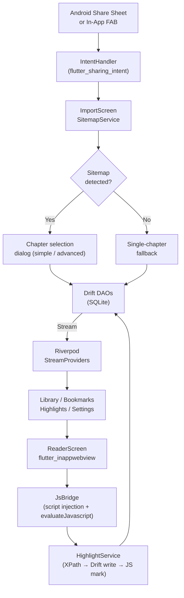

# Read4ever

**Turn scattered docs and tutorials into a structured, trackable reading workflow — on your Android device, fully offline.**

[](https://play.google.com/store/apps/details?id=com.devsarc.docuer&hl=en_US)

[Devpost submission](https://devpost.com/software/read4ever)

---

## Overview

Self-taught developers collect online learning resources compulsively but rarely finish them. Browser tabs pile up, links get lost, and annotations end up scattered across Notion, Readwise, and sticky notes.

Read4ever is an Android app built for this exact failure mode. It handles the full learning loop in one place: import a URL from Chrome or paste it in-app, read it in a distraction-free WebView, highlight what matters, bookmark chapters to revisit, and track progress across every resource in your library — all stored locally with no account required.

The strongest differentiator is the highlight system: text selections are stored using XPath position data so they survive page navigation, are visually restored on every load, and remain linked to the exact chapter and resource they came from.

---

## Preview

| Library | Highlights |
|---|---|
|  |  |

| Import | Reader |
|---|---|
|  |  |

---

## Highlights

- **XPath-based highlight persistence** — text selections are stored as XPath + character offsets, resolved and re-injected into the WebView on every page load using a two-phase DOM algorithm that prevents sibling-index corruption
- **Sitemap-driven multi-chapter import** — three-strategy sitemap discovery (`/sitemap.xml`, `/sitemap_index.xml`, `<link rel="sitemap">`) with recursive XML parsing; falls back gracefully to single-chapter for non-docs URLs
- **Zero-backend, reactive data layer** — Drift streams feed directly into Riverpod `StreamProvider`s; every screen rebuilds automatically when the database changes, no manual refresh needed
- **Native Android text selection integration** — highlights use `flutter_inappwebview`'s `ContextMenu` API rather than custom JS overlay positioning, giving reliable system-consistent UX
- **Intentional design system** — DM Sans, teal accent, 4px spacing grid, cohesive light/dark themes with consistent component overrides across all screens
- **Full import-to-annotation pipeline** — share sheet cold-start and warm-open handling, duplicate detection before any network call, two-mode import dialog (simple checkboxes vs. advanced reorder/rename)

---

## Features

### Import
- Share any URL from Chrome → app opens with URL pre-filled (cold start + warm open)
- Sitemap detection with chapter selection: checkboxes in simple mode, drag-to-reorder + rename in advanced mode
- Duplicate detection: opens existing resource/chapter instead of re-importing
- Fallback notification when sitemap detection fails ("couldn't extract other chapters")
- In-app FAB for importing without leaving the app

### Reading
- Full-screen WebView reader with linear loading indicator
- Toolbar: back, chapter dropdown (with done checkmarks), bookmark toggle, done toggle
- Zero-duration chapter transitions via `pushReplacement` + `CustomTransitionPage`
- Error state with retry on load failure
- Chapter titles auto-updated from `document.title` on `onPageFinished`

### Highlighting
- Select text → native Android ContextMenu → Highlight or Add Note
- Highlights visually marked in WebView using `<mark>` elements with teal tint
- Notes distinguished by dashed underline
- Tapping a mark in the WebView triggers a Dart callback via JS handler
- Highlights screen: filter by resource or chapter, double-tap to expand, navigate to position in reader, edit/delete notes
- Bulk delete with multi-select (long-press to enter)

### Library & Progress
- Resource cards: title, description, chapter count, progress bar, Resume button
- Continue Reading strip: up to 3 in-progress resources, sorted by last accessed
- Smart sort: in-progress → not started → done (muted, bottom)
- Empty state on first launch

### Resource Management
- Inline-editable title and description
- Drag-to-reorder chapters, per-item delete with cascade warning
- Import additional chapters from the same source
- Delete resource with confirmation showing highlight/bookmark count to be lost
- Bulk multi-select across chapters, highlights, and bookmarks

### Bookmarks
- Bookmark toggle in reader toolbar
- Bookmarks screen with prev/next FAB navigation when reading from the queue

### Settings
- Light / Dark / System theme (persisted via `SharedPreferences`)
- Delete all data with confirmation

---

## Tech Stack

| Layer | Technology | Purpose |
|---|---|---|
| Framework | Flutter (Android, SDK ^3.5) | UI and app shell |
| State management | Riverpod 2 + `riverpod_annotation` | Compile-safe providers, `AsyncValue` error handling, codegen |
| Navigation | `go_router` 14 | Declarative routing, `ShellRoute` for persistent drawer, typed extras |
| Database | Drift 2 + `sqlite3_flutter_libs` | Type-safe SQLite ORM, native `Stream<T>` support, DAOs |
| WebView | `flutter_inappwebview` 6 | Bidirectional JS channels, `ContextMenu` API, `evaluateJavascript` return values |
| Data classes | `freezed` | Immutable UI state models, `copyWith`, pattern matching |
| Fonts | `google_fonts` | DM Sans |
| HTTP + XML | `http` + `xml` | Sitemap discovery and parsing |
| Persistence | `shared_preferences` | Theme setting |
| Share intent | `flutter_sharing_intent` | Android share sheet (cold start + warm open) |

---

## Architecture



**Core data flow:**

```
URL shared from Chrome
  → Intent → IntentHandler → /import?url=...
  → SitemapService: validate → deduplicate → discover → parse XML
  → ImportDialog: user selects chapters → ResourcesDao + ChaptersDao write
  → Library rebuilds reactively from Drift stream
  → User taps Resume → ReaderScreen opens chapter in WebView
  → onPageFinished: inject JS scripts, restore highlights, update chapter title
  → User selects text → ContextMenu → Highlight
  → JsBridge.getSelection() → text + XPath returned to Dart
  → HighlightService: write to SQLite → inject <mark> via JS
```

---

## How It Works

1. **Import** — Paste or share a URL. The app validates it, checks for duplicates, and attempts sitemap discovery. For docs sites, a dialog lets you pick which chapters to import and reorder them. Standalone articles are imported in one tap.

2. **Library** — All resources appear as cards with progress bars. The Continue Reading strip at the top surfaces your three most recently active resources. Done resources sink to the bottom with a muted style.

3. **Read** — The reader is a full-screen WebView with a minimal toolbar. Chapter titles are resolved from `document.title` on load. Tapping the chapter dropdown lets you jump anywhere in the resource without leaving the reader.

4. **Highlight** — Select text and tap "Highlight" or "Add Note" from the system text selection menu. The selection's XPath and character offsets are captured via `evaluateJavascript`, written to SQLite, and immediately wrapped in a `<mark>` element in the WebView. Notes get a dashed underline style.

5. **Restore** — On every page load, all highlights for the chapter are fetched from SQLite and re-injected. The restore algorithm pre-resolves all XPaths before any DOM mutation, then processes highlights in reverse document order to prevent sibling index corruption during `<mark>` insertion.

6. **Review** — The Highlights screen shows every annotation across all resources, filterable by resource or chapter. Tapping one opens a bottom sheet to navigate to its position in the reader, edit the note, or delete it.

---

## Setup

**Prerequisites**

- Flutter SDK ≥ 3.5 ([install](https://docs.flutter.dev/get-started/install))
- Android device or emulator (API 21+)
- No API keys or backend required

**Install and run**

```bash
cd read4ever
flutter pub get
flutter run
```

**Regenerate code** (Drift, Riverpod, Freezed — only needed after schema/model changes)

```bash
flutter pub run build_runner build --delete-conflicting-outputs
```

**Lint**

```bash
flutter analyze
```

---

## Usage

**Import from Chrome (recommended)**

1. Open any documentation page in Chrome
2. Tap Share → Read4ever
3. Select chapters (or confirm immediately for a single article)
4. You're in the reader

**Import in-app**

1. Tap the `+` button in the Library
2. Paste a URL and tap confirm

**Highlight text**

1. Long-press any text in the reader to select it
2. Tap **Highlight** (no note) or **Add Note** (with annotation)
3. The highlight is saved immediately and persists across sessions

---

## Key Decisions

| Decision | Rationale | Tradeoff |
|---|---|---|
| `flutter_inappwebview` over `webview_flutter` | Highlights require bidirectional JS channels, `evaluateJavascript` return values, and `ContextMenu` API — none of which `webview_flutter` supports | Heavier dependency, more complex API |
| Native Android `ContextMenu` for highlight toolbar | Uses the system text selection mechanism — no custom overlay positioning, no scroll offset edge cases, familiar UX | Menu items follow system styling, not custom-designed |
| `bookmarked_at` nullable timestamp on `chapters` (not a separate table) | Bookmarks are 1:1 with chapters; the timestamp gives ordering for the Bookmarks screen with no JOIN | Slightly less normalized schema |
| Two-phase XPath highlight restore | Pre-resolving all XPaths before DOM mutation prevents sibling index corruption when multiple highlights share the same region | More complex restore algorithm |
| Drift `Stream<T>` → Riverpod `StreamProvider` data flow | Every screen rebuilds automatically on database change with no manual invalidation | All providers are alive for the app lifetime; acceptable for a local-only, single-user app |

---

## Innovation / Notable Work

**XPath-based highlight persistence with DOM-safe restore**

Storing text highlights in a WebView is hard because the DOM changes: page loads, chapter navigations, and docs site updates all invalidate naive approaches. Read4ever stores the XPath path from document root to the text node, plus character offsets within that node. The restore algorithm has two non-obvious properties:

1. **Pre-resolution before mutation** — all XPaths are resolved into `Range` objects *before* any `<mark>` is inserted. Each insertion changes sibling indices; resolving everything first captures stable node references.
2. **Reverse document order** — highlights are applied last-to-first so earlier highlights' boundary points aren't invalidated by later insertions in the same region.

Cross-element selections (where the range spans multiple tags) are handled by falling back from `surroundContents` to `extractContents` + `insertNode`.

**Three-layer JS bridge**

The JS/Dart boundary is split into three independent layers: `js_bridge.dart` (WebView interop only — channel registration, script injection, `evaluateJavascript` calls), `highlight_service.dart` (domain logic — owns the sequence: DB write → JS apply), and `.js` asset files (the actual scripts, independently readable and testable). This means a WebView package swap doesn't touch domain logic, and a highlight behavior change doesn't touch WebView plumbing.

**Reactive data layer without manual invalidation**

Every mutable database query returns a `Stream<T>` from Drift. Riverpod `StreamProvider`s wrap these streams. Every widget that reads a provider rebuilds automatically when the underlying data changes — no `setState`, no manual cache invalidation, no stale state bugs.

---

## About

Read4ever started as an experiment in spec-driven development: write a complete PRD and technical spec before touching code, then build against the spec. The result is an app where 14 of 15 planned checklist items shipped in the first build pass, the hard parts (XPath highlights, share sheet handling, sitemap parsing) worked on the first real test, and the codebase has a clear paper trail from user story to data model to implementation.

The problem it solves is real: the gap between saving a link and actually finishing what's in it.
